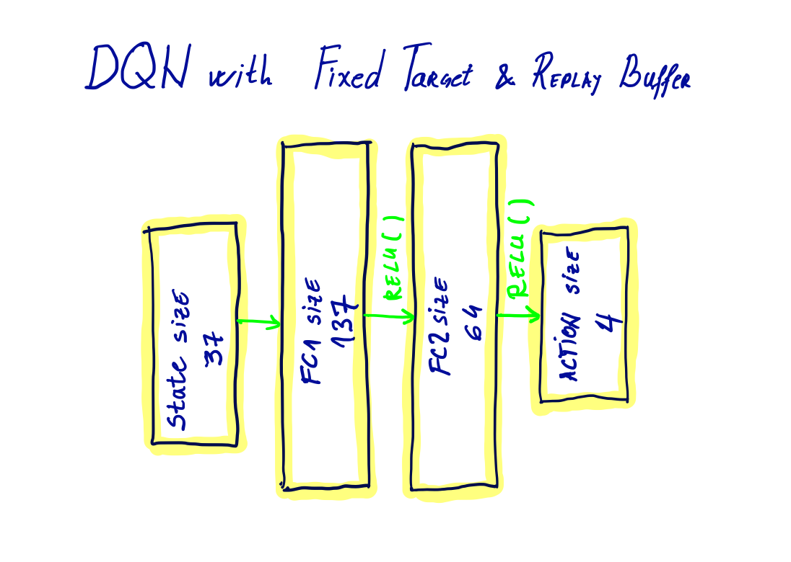
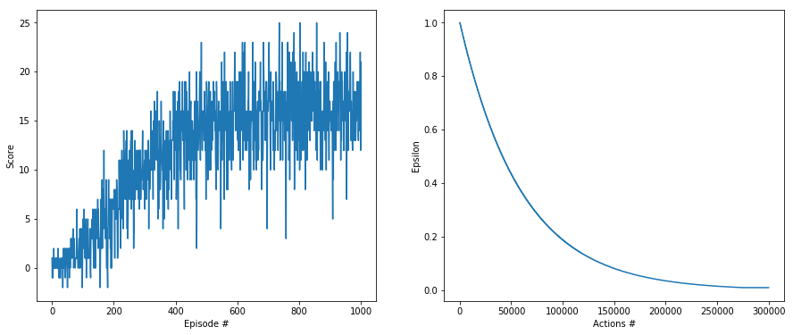
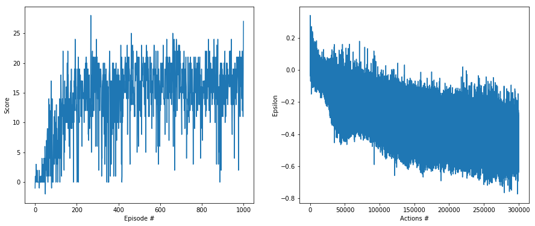

# Report

##Learning Algorithm

To solve Navigation project, I used as basis the code from a DQN lesson that implements DQN with Fixed Target and Experience Replay improvements.
[https://github.com/udacity/deep-reinforcement-learning/tree/master/dqn](https://github.com/udacity/deep-reinforcement-learning/tree/master/dqn) 

In *Fixed Target* algorithm improvement we are using a separate network with a fixed parameter w_ for estimating the TD target and at *UPDATE_EVERY* step, we copy the parameters from our DQN network to update the target network.

In *Experience Replay* we are storing agent’s experiences, and then randomly drawing batches of them to train the network. By keeping the experiences we draw random, we prevent the network from only learning from immediate experiences, and allow it to learn from a more varied array of past experiences. The Experience Replay buffer stores a fixed number of recent memories, and as new ones come in, old ones are removed.

In addition to these improvements, I have implemented the * Dueling DQN *. Dueling DQN separates the Q(s,a) estimator to two streams, first that estimates the state value V(s) and second that estimates the advantage for each action A(s,a). At the output we combine these two streams through a special aggregation layer to get an estimate of Q(s,a).

Original code is in first step customized to use * Unity ML-Agents * environment. The main part of the program is in following files

	dqn_agent.py
    dqn_agent_eps.py
	model.py
	hyperparmeters.py
	Navigation.ipynb
	
*dqn_agent.py* code implements an environment-aware agent, *dqn_agent_eps.py* implements an agent who is learning the epsilon value, while in *model.py* is a neural network model that approximates the Q(s, a) function.
*hyperparmeters.py* sadrzi hiperparametre.
*Navigation.ipynb* sadrzi kod koji trenira agenta za resavanje problema i prikazuje rezultate.

####Version 1 - DQN with target network and Experience Replay
The model of the neural network used is shown in the picture:

The input parameter is the state of the environment (size 37), and the output is probability distribution of actions (size 4).

The size of the hidden layers are:
FC1 size = 64
FC2 size = 64

When Dueling DQN improvement were used, the network output was changed as in the picture:

Pink branch is used only in version 2 of network, which will be described later.

The hyper parameters are: 

	BUFFER_SIZE = int(1e5)  # replay buffer size
	BATCH_SIZE = 128        # minibatch size
	GAMMA = 0.99            # discount factor
	TAU = 1e-3              # for soft update of target parameters
	LR = 5e-5               # learning rate 
	UPDATE_EVERY = 4        # how often to update the target network
	

By changing the hyper parameter GAMMA, I did not get a significant improvement in the results, decreasing gives worse results, and the increase does not make a significant improvement.
Changing the TAU also did not give me a significant improvement.
By increasing BATCH_SIZE = 128, better results are obtained, as is the reduction of learning rate LR = 5e-5.
Other hyper parameters have the same values as in the original project.

Results after 1000 episodes are:

	Episode 100	Average Score: 0.98
	Episode 200	Average Score: 3.68
	Episode 300	Average Score: 8.53
	Episode 400	Average Score: 11.56
	Episode 468	Average Score: 13.02
	Environment solved in 368 episodes!	Average Score: 13.02
	Episode 500	Average Score: 13.71
	Episode 600	Average Score: 14.71
	Episode 700	Average Score: 15.21
	Episode 800	Average Score: 15.99
	Episode 900	Average Score: 16.27
	Episode 1000	Average Score: 16.32
    

Agent solves the problem after 368 episodes.

####Version 2 - DQN with Fixed Target, Experience Replay and Epsilon learning

Next I tried to use the neural network to learn epsilon value depending on the state of environment. The neural network model is shown in the following figure:

The input parameter is the state of the environment (size 37), and the output is probability distribution of actions and epsilon value (size 4 + 1).
The sizes of the hidden layers are:
FC1 = 137
FC2 = 64

Hyper parameters are:

	BUFFER_SIZE = int(1e5)  # replay buffer size
	GAMMA = 0.99            # discount factor
    BATCH_SIZE = 64         # minibatch size
	TAU = 1e-3              # for soft update of target parameters
	LR = 5e-4               # learning rate 
	UPDATE_EVERY = 4        # how often to update the target network
    
Version 2 DQN with epsilon learning "likes" smaller batches and larger learninig rates then version 1 DQN. 
In the case of using the Dueling DQN improvement, the output of the network is replaced by the model in the image:

In version 2, a pink branch is also used. Network configuration with the Dueling DQN and epsilon learning did not yield good results, so I did not use it in final configuration of version 2 network.

Results after 1000 episodes are much better than in version 1:

	Episode 100	Average Score: 3.37
	Episode 200	Average Score: 11.20
	Episode 229	Average Score: 13.04
	Environment solved in 129 episodes!	Average Score: 13.04
	Episode 300	Average Score: 14.90
	Episode 400	Average Score: 13.99
	Episode 500	Average Score: 15.81
	Episode 600	Average Score: 16.32
	Episode 700	Average Score: 17.05
	Episode 800	Average Score: 15.53
	Episode 900	Average Score: 15.93
	Episode 1000	Average Score: 16.68
	

Agent solves the problem for 129 episodes.

##Conclusion

The best results are obtained with the model
DQN + Fixed Target + Replay Buffer + Epsilon learning and the sizes of the hidden leyers FC1 = 137 and FC2 = 64. With this network configuration and hyper parameters, the agent solves the problem for less than 200 episodes.

##Ideas for Future Work 	
The next step that would, I belive, further improve the algorithm in each of the tested variants is the implementation of the Prioritized Experience Replay algorithm [https://arxiv.org/pdf/1511.05952](https://arxiv.org/pdf/1511.05952), as well as experiments with the size and number of hidden layers.

##References
1. [https://medium.freecodecamp.org/improvements-in-deep-q-learning-dueling-double-dqn-prioritized-experience-replay-and-fixed-58b130cc5682](https://medium.freecodecamp.org/improvements-in-deep-q-learning-dueling-double-dqn-prioritized-experience-replay-and-fixed-58b130cc5682) 
2.  [https://medium.com/@awjuliani/simple-reinforcement-learning-with-tensorflow-part-4-deep-q-networks-and-beyond-8438a3e2b8df](https://medium.com/@awjuliani/simple-reinforcement-learning-with-tensorflow-part-4-deep-q-networks-and-beyond-8438a3e2b8df) 